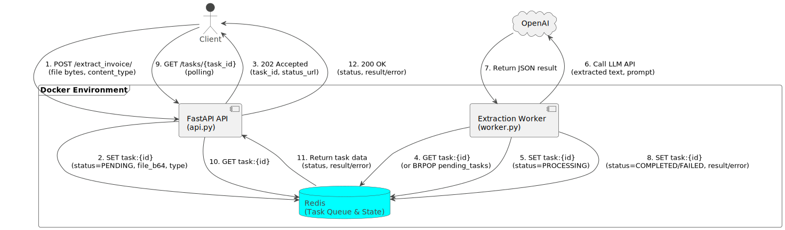

# Overview

This repository contains a scalable microservice-based demo for extracting structured data from invoices using an LLM. This demo repository showcases a scalable FastAPI-based architecture that handles pdf/txt document uploads, asynchronous processing, and returns structured JSON data through a RESTful API.

For code generation the LLMs Gemini and Claude Sonnet were employed.

# Architecture diagram



# Example usage using Docker

- Copy `.env.template` to `.env`, and edit the latter by setting the environment variable `OPENAI_API_KEY` representing a working OpenAI's api key 

- Start up docker services 
    ```bash
    docker-compose up
    ```

- Download an invoice example in text format and store it as `invoice.txt`

    ```bash
    curl -s https://gist.githubusercontent.com/jezen/c05c0944a2fc32512321/raw/ > invoice.txt
    ```

- POST the local file to the extraction service and keep the `task_id` from the response

    ```bash
    curl -v -X POST \
    -H "Accept: application/json" \
    -F "file=@invoice.txt" \
    http://127.0.0.1:8000/extract_invoice/
    ```

- GET task status for the relevant `task_id` reported from the previous command
  
    ```bash
    curl -v X GET http://127.0.0.1:8000/tasks/<task_id>
    ```

    A successfully finished task contains a field `result` with the json-content of the processed invoice.
